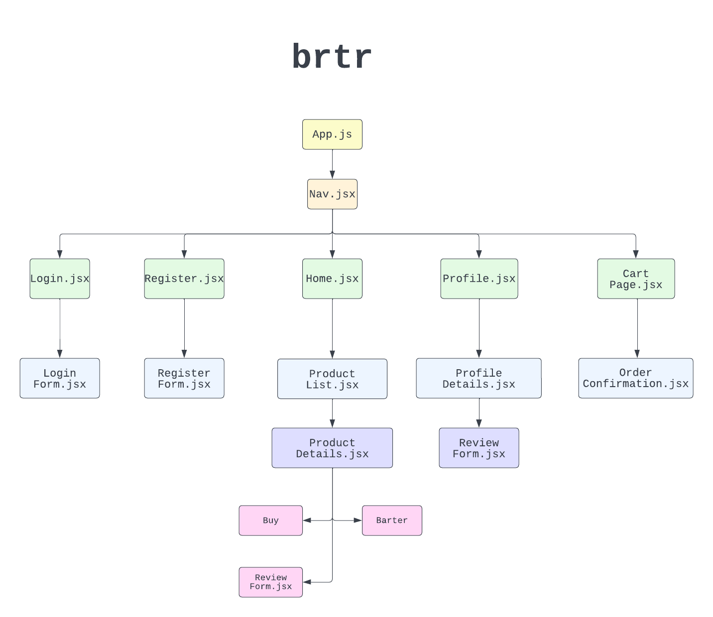
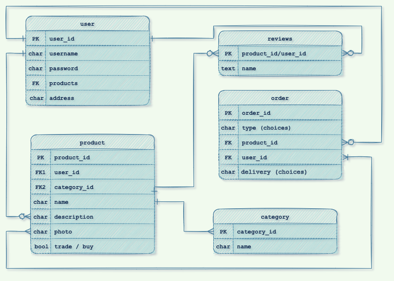
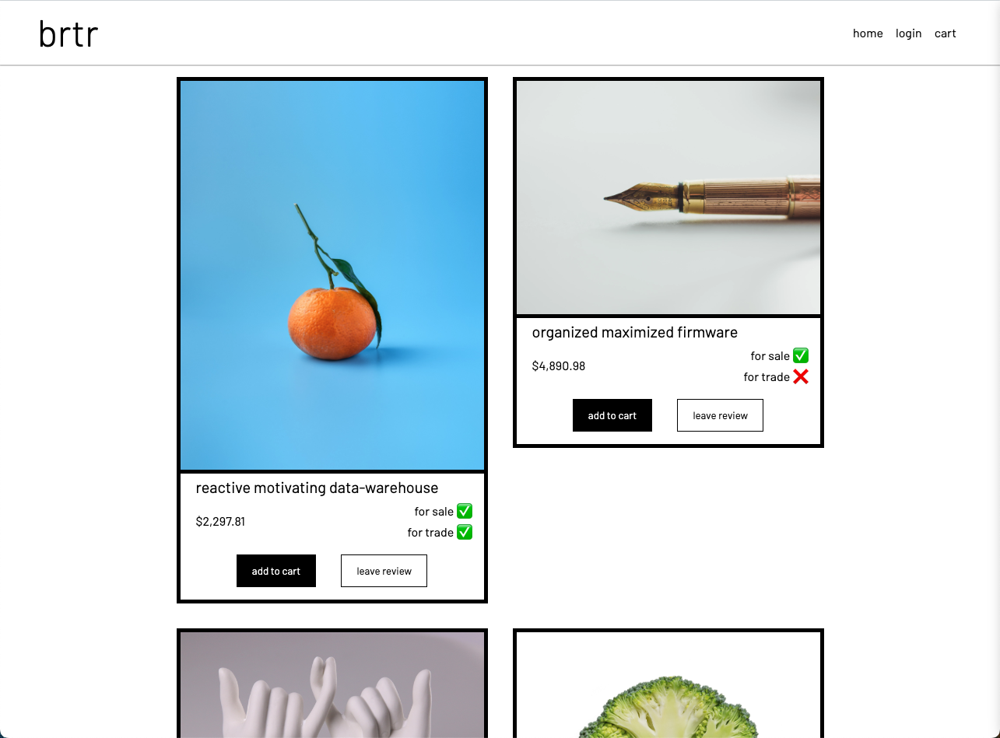

# brtr

## Date: 09/14/2022

### By: Austin Taylor

[Website](https://wwww.austinrt.io) | [GitHub](https://github.com/austin-rt) | [LinkedIn](https://www.linkedin.com/in/austinrt/)

### **_Deployed Site_**

[brtr](https://brtr-app.herokuapp.com/)

---
### **_Description_**

brtr functions as a simulated buy / sell platform for any type of item. You can tell how cool and hip and 2010s we are by the lack of vowels in our name.

Users can browse as a guest or create an account for the full experience. With an account users will be able to list and sell thier items and buy other users items.

A post MVP version sees reviews for both users and items, credit card processing, user and product reviews, and a barter system to trade items instead of using money.

### Intended Crud Functionality

- Create - user can create listings and reviews
- Read - user can view listings / reviews
- Update - user can update thier own creatinos
- Delete - user can delete thier own creations

### **_Technologies Used_**

- PosgreSQL
- Django
- React.js
- Node.js
- Heroku

#### **_Component Hierarchy Diagram:_**

#### **_Entity Relationship Diagram:_**

### **_Screen Shots_**

##### Home Page

### **_Sources_**

Style and organization will be inspired by [asos's](https://www.asos.com/) 2022 styling.

### ***Trello Board***

[brtr Trello Board](https://trello.com/b/z5jejlqh/brtr)

 

### ***Future Features***
1. credit card processing
2. user reviews
3. product reviews
4. barter system

### ***License***

MIT License

###### Copyright &copy; 2022 Austin Taylor